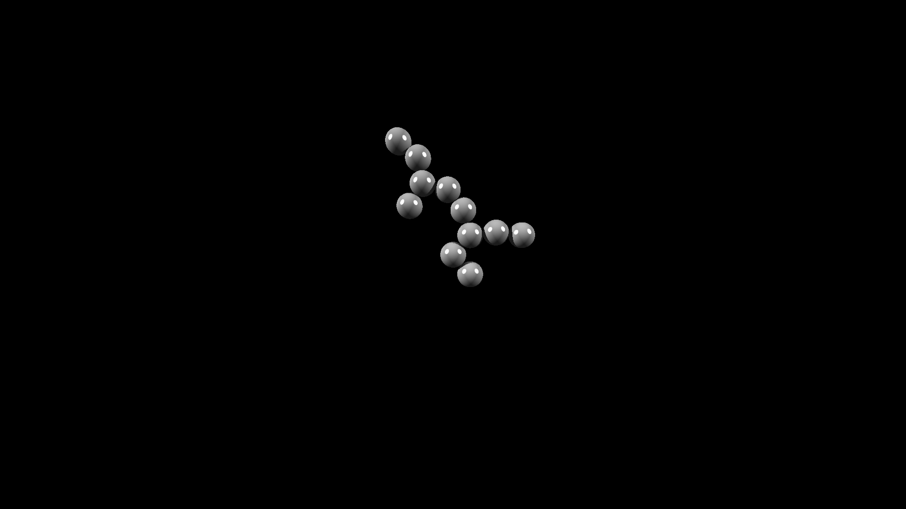

# dla-rust

Algorithm taken from [Michael Fogelman's dlaf.](https://github.com/fogleman/dlaf)

### Usage

```Rust
use dla::Builder;

fn main() {
    let mut model = Builder::flat();

    model.add([0., 0.].into(), 1);

    for _ in 0..10000 {
        model.add_particle();
    }

    model.save_csv("out.csv").unwrap();
    
    dla::Raycaster::flat(model.index)
        .with_color([1., 1., 1.])
        .render("render.png");
}

```

### Output Formats

CSV

```bash
$ head output.csv

index,parent,x,y,z
0,9101,0.6332,181.0855,0.0000
1,9142,0.4418,182.0670,0.0000
2,9386,0.1673,183.9447,0.0000
3,9172,-0.0078,182.9602,0.0000
4,9199,-0.9820,183.1860,0.0000
```

### Image

I'm using raycaster from repo: [Simple-raytraces](https://github.com/ebobby/simple-raytracer). 




